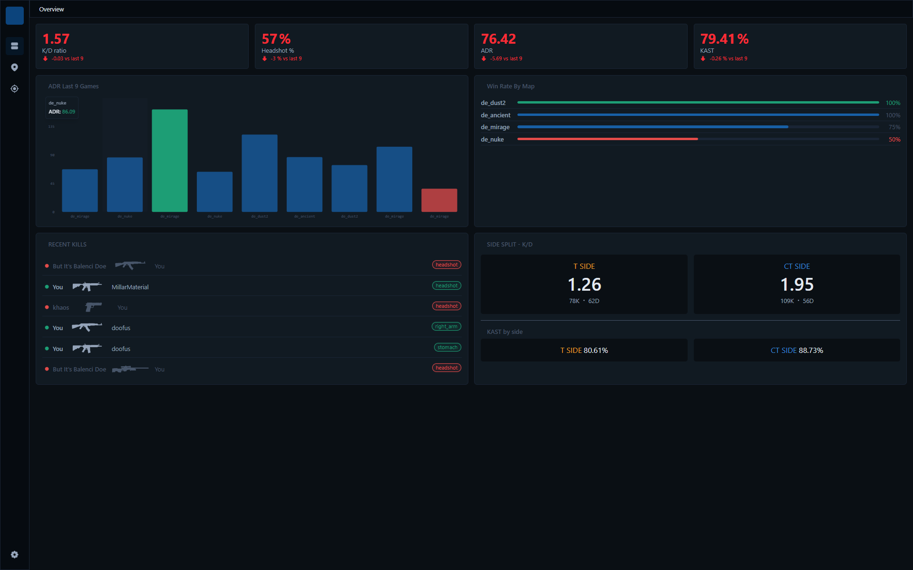
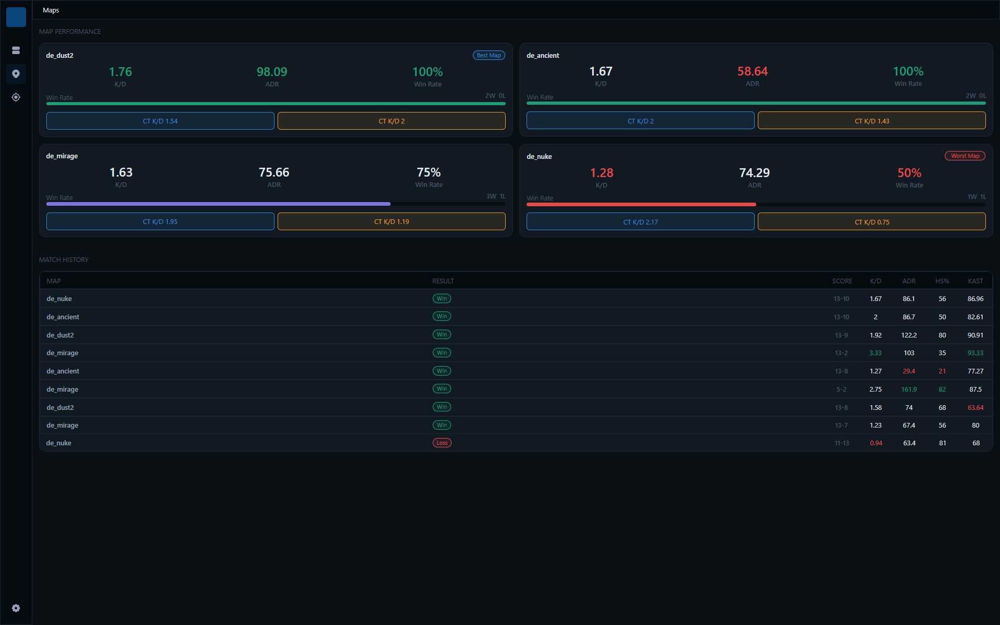
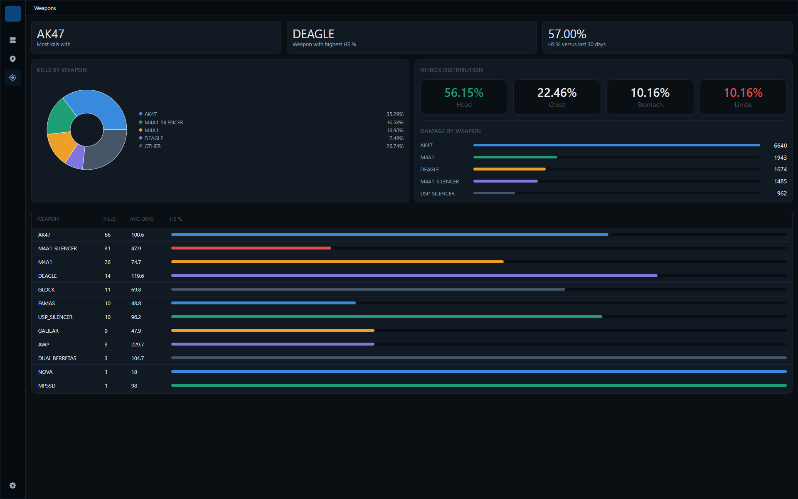
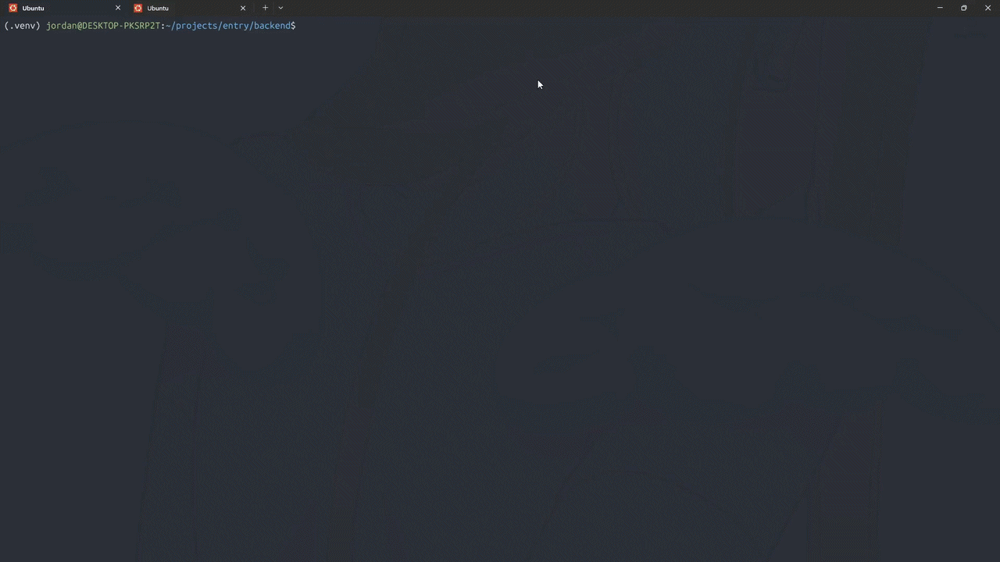

# CS2 Demo Stat Tracker

A personal CS2 statistics tracker that parses match demo files to extract and visualise performance data. The goal is to track kills, deaths, damage, and positional data across matches and display them in a modern web dashboard.

---

## Screenshots & Demos

### Overview


### Maps


### Weapons


### Demo


---

## Features

- **Demo Parsing:** Uses `demoparser2` to extract raw event data from CS2 `.dem` files.
- **Stat Computation:** Calculates K/D, ADR, Headshot %, and KAST with side-split support.
- **Trend Analysis:** Compare current performance against recent matches (moving averages).
- **Match History:** Persistent storage using SQLite.
- **Automated Pipeline:** Automatic ingestion and cleanup of demo files.
- **Modern Dashboard:** React-based frontend with interactive charts (WIP).

---

## Project Structure

```
entry/
├── backend/            # FastAPI Server & Ingestion
│   ├── main.py         # API Endpoints
│   ├── app.py          # Ingestion logic
│   ├── parser.py       # Demo parsing
│   ├── stats.py        # Stat computation
│   ├── db.py           # Database management
│   └── watcher.py      # File cleanup & automation
├── frontend/           # React Dashboard
│   ├── src/
│   │   ├── components/ # Reusable UI & Charts
│   │   ├── pages/      # Dashboard views (Overview, Heatmaps, etc.)
│   │   └── api/        # Backend communication
├── demos/              # Drop .dem files here for ingestion
└── README.md
```

---

## Getting Started

### Backend Setup

1. **Navigate to backend directory**
   ```bash
   cd backend
   ```
2. **Create and activate a virtual environment**
   ```bash
   python -m venv .venv && source .venv/bin/activate
   ```
3. **Install dependencies**
   ```bash
   pip install -r requirements.txt
   ```
4. **Configure `config.py`**
   ```python
   PLAYER_NAME = "YourName"
   DEMO_DIRECTORY = "/path/to/your/demos"
   ```
5. **Run the API server**
   ```bash
   fastapi dev main.py
   ```

### Frontend Setup

1. **Navigate to frontend directory**
   ```bash
   cd frontend
   ```
2. **Install dependencies**
   ```bash
   npm install
   ```
3. **Run the development server**
   ```bash
   npm run dev
   ```
4. Open http://localhost:5173 in your browser. The backend must be running for data to load.

---

## Ingesting a Demo

Drop any CS2 .dem or .dem.bz2 file into the demos/directory. The backend will detect it, part it, store the results in SQLite, and delete the file when done. An example demo is included in docs/ if you want to verify the setup.

## Stat Definitions

- **K/D** — Kills divided by deaths.
- **ADR** — Average Damage per Round.
- **HS %** — Percentage of kills that were headshots.
- **KAST** — Percentage of rounds with a Kill, Assist, Survival, or Traded death.

---

## Acknowledgements

- [demoparser2](https://github.com/LaihoE/demoparser) — CS2 demo parsing
- [FastAPI](https://fastapi.tiangolo.com/) — Backend framework
- [Vite](https://vitejs.dev/) & [React](https://reactjs.org/) — Frontend stack
- [Tailwind CSS](https://tailwindcss.com/) — Styling
- [Recharts](https://recharts.org/) & [D3](https://d3js.org/) — Charts
